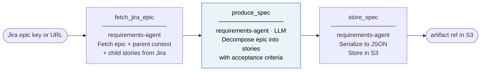
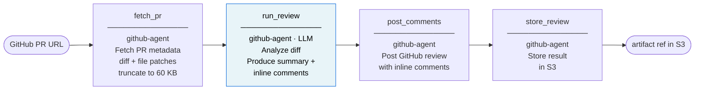
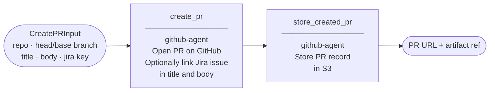
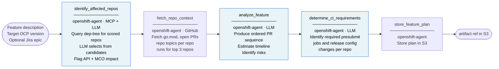
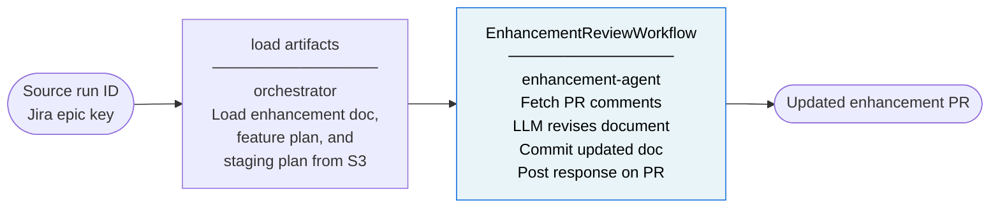
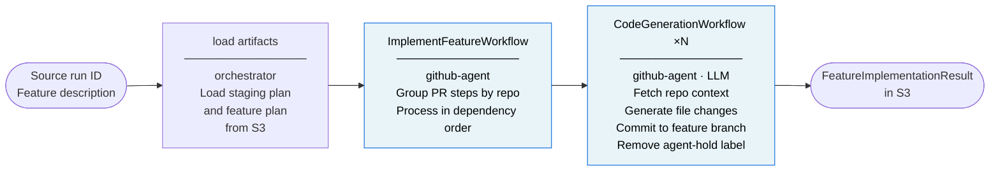

```mermaid
flowchart TD
    START([Jira epic URL or key]) --> A

    A["**Phase A** · EnsureEpicWorkflow\n─────────────────────────\njira-agent\nFetch existing epic or create a new one"]

    A --> B["**Phase B** · EnhancementWorkflow\n─────────────────────────\nenhancement-agent\nGenerate enhancement doc from epic context\nLLM picks repos_to_fork\nFork enhancements repo → commit → open PR\nCreate design-doc-review story in Jira"]

    B --> C{{"⏸ **Phase C** · Human Gate\n─────────────────────────\nWaitForEnhancementApprovalWorkflow\nPoll PR every 5 min\nReviewers can edit repos_to_fork"}}

    C -- approved --> D
    C -- closed --> ABORT([Mark story Won't Do · exit])

    D["**Phase D** · Mirror, Load & Fork\n─────────────────────────\nMirror repos from GitHub into Gitea\n(Gitea only · repos that fail to mirror are dropped)\nLoad approved enhancement doc\nFork repos_to_fork into staging org"]

    D --> E["**Phase E** · OpenShiftFeatureWorkflow\n─────────────────────────\nopenshift-agent\nAnalyse approved repos\nSkips MCP discovery when repos pre-set\nProduce implementation plan\nDetermine CI requirements"]

    E --> F["**Phase F** · StoryRefinementWorkflow\n─────────────────────────\njira-agent\nLLM proposes sized & prioritized stories\nPost proposals as Jira comment"]

    F --> FG{{"⏸ **Phase F** · Human Gate\n─────────────────────────\nPoll epic comments every 5 min\nnew comments → LLM refines → re-post"}}

    FG -- stories approved --> G
    FG -- feedback --> F

    G["**Phase G** · CreateStoriesWorkflow\n─────────────────────────\njira-agent\nCreate stories in Jira\nSet story points, priority, dependency links"]

    G --> H["**Phase H** · SetupStagingReposWorkflow\n─────────────────────────\ngithub-agent · runs concurrently per repo\nCreate feature branch\nOpen draft PR → add agent-hold label"]

    H --> I["**Phase I** · ImplementFeatureWorkflow\n─────────────────────────\ngithub-agent · one CodeGenerationWorkflow per repo\nLLM generates code changes\nCommit to feature branches\nRespects dependency order"]

    I --> J{{"⏸ **Phase J** · MonitorPRWorkflow ×N\n─────────────────────────\ngithub-agent · one per repo · up to 90 days\nPoll PR every 5 min"}}

    J -- agent-hold dropped --> JC["LLM processes review comments\nApply file changes · post response\nRe-add agent-hold"]
    JC --> J
    J -- PR merged/closed --> DONE([Done])

    style C fill:#fff3cd,stroke:#856404,color:#000
    style FG fill:#fff3cd,stroke:#856404,color:#000
    style I fill:#e8f4f8,stroke:#0969da,color:#000
    style J fill:#fff3cd,stroke:#856404,color:#000
    style ABORT fill:#f8d7da,stroke:#842029,color:#000
    style DONE fill:#d1e7dd,stroke:#0f5132,color:#000
```

# Agent SDLC Workflow

Hierarchical LLM agents for automating the full OpenShift feature SDLC, powered by [Temporal](https://temporal.io/) and [LiteLLM](https://github.com/BerriAI/litellm).

## Architecture

```
Trigger (CLI / future: webhook)
  └── SDLCOrchestratorWorkflow  [task_queue: orchestrator]
        │
        ├── FullSDLCWorkflow                          full end-to-end OpenShift feature flow
        │     ├── EnsureEpicWorkflow                  [jira-agent]       fetch or create Jira epic
        │     ├── EnhancementWorkflow                  [enhancement-agent] generate enhancement doc from epic context & open PR
        │     ├── WaitForEnhancementApprovalWorkflow   [enhancement-agent] poll PR until approved or closed
        │     ├── MirrorReposWorkflow                   [github-agent]     mirror repos from GitHub into Gitea (Gitea only)
        │     ├── ForkReposWorkflow                    [github-agent]     fork repos_to_fork from approved enhancement doc
        │     ├── OpenShiftFeatureWorkflow             [openshift-agent]  analyse approved repos, produce plan
        │     ├── StoryRefinementWorkflow              [jira-agent]       propose stories, iterate with humans
        │     ├── CreateStoriesWorkflow                [jira-agent]       create, size, prioritize, link stories
        │     ├── SetupStagingReposWorkflow            [github-agent]     create branches & draft PRs
        │     ├── ImplementFeatureWorkflow              [github-agent]     LLM code gen per repo in dependency order
        │     │     └── CodeGenerationWorkflow (×N)     [github-agent]     generate + commit code for one repo
        │     └── MonitorPRWorkflow (×N)               [github-agent]     watch agent-hold label, process comments
        │
        ├── EnhancementReviewWorkflow                 review & revise enhancement doc from PR comments
        │     load artifacts → fetch PR comments → LLM revises doc → commit & respond
        │
        ├── RequirementsWorkflow  [requirements-agent]
        │     fetch_jira_epic → produce_spec (LLM) → store to S3
        ├── ReviewWorkflow        [github-agent]
        │     fetch_pr → run_review (LLM) → post_comments → store to S3
        ├── CreatePRWorkflow      [github-agent]
        │     create_pr → store to S3
        └── OpenShiftFeatureWorkflow  [openshift-agent]
              identify_repos (MCP + LLM) → fetch_context → analyze (MCP + LLM) → ci_requirements → store to S3
```

LiteLLM abstracts all LLM calls — swap providers (OpenAI, Anthropic, Ollama, etc.) via the `LITELLM_MODEL` env var with no code changes.

## Full SDLC Flow

The `full_sdlc` task type runs the complete OpenShift feature development workflow. Phases execute sequentially; human approval gates pause the workflow until a human acts.



Human approval gates (yellow diamonds) are implemented as Temporal polling loops — workers are never blocked; the workflow sleeps between polls and resumes durably across restarts.

## Task Types

### `requirements`

Fetches a Jira epic (by key or URL), aggregates its child stories and parent context, then uses an LLM to produce a structured requirement specification. The spec is stored as a JSON artifact in S3.



---

### `review`

Fetches a GitHub PR's diff and metadata, runs an LLM code review that produces a summary and inline comments, then posts the review back to GitHub.



---

### `create_pr`

Creates a pull request on any GitHub repository. Optionally prefixes the title with a Jira issue key and adds a Jira link to the PR body.



---

### `openshift_feature`

Analyzes an OpenShift feature description to identify which repositories are affected, fetches live GitHub context for each, produces an ordered implementation plan with PR sequencing, and determines CI requirements.



---

### `full_sdlc`

The `full_sdlc` task type runs the complete OpenShift feature development workflow. Phases execute sequentially; human approval gates pause the workflow until a human acts.


Human approval gates (yellow diamonds) are implemented as Temporal polling loops — workers are never blocked; the workflow sleeps between polls and resumes durably across restarts.

---

### `enhancement_review`

Re-runs the enhancement review cycle on an existing enhancement PR. Loads the enhancement doc and feature plan from a previous `full_sdlc` run, fetches new PR review comments, uses an LLM to revise the document, commits the update, and posts a response addressing each reviewer comment.



---

### `implement_feature`

Takes the staging plan and feature plan from a previous `full_sdlc` run and generates code changes for each repository. Repos are processed in dependency order — a repo blocked by another waits until the dependency completes.



---

## Two environments

| | Local dev | Integration / pre-deploy |
|---|---|---|
| **Command** | `make dev` | `make cluster` |
| **Tool** | podman-compose | Kind + kubectl + helm |
| **Startup** | ~1 min + model pull | ~5 min (first run) |
| **Workers** | Containers in compose | Pods in Kubernetes |
| **Use for** | Day-to-day development | Testing k8s manifests and NetworkPolicies |

---

## Prerequisites

```bash
# podman + podman-compose (local dev)
# On Fedora/RHEL:
sudo dnf install podman podman-compose

# uv (Python package manager)
curl -Ls https://astral.sh/uv/install.sh | sh

# Kind + kubectl + helm (integration testing only)
# kind:    https://kind.sigs.k8s.io/docs/user/quick-start/#installation
# kubectl: https://kubernetes.io/docs/tasks/tools/
# helm:    https://helm.sh/docs/intro/install/
```

---

## Local dev setup (podman-compose)

### 1. Clone and configure

```bash
git clone <repo>
cd agent-sdlc-workflow
cp .env.example .env
```

Edit `.env` — at minimum fill in your credentials. The default is Ollama with Qwen2.5 7B (no API key needed):

```bash
LITELLM_MODEL=ollama/qwen2.5:7b-instruct-q4_K_M   # pulled automatically on first start
# LLM_API_KEY=                                      # not needed for Ollama

GITHUB_TOKEN=ghp_...
STAGING_GITHUB_ORG=your-staging-org                 # GitHub org where forks are created
JIRA_URL=https://yourorg.atlassian.net
JIRA_USER=user@example.com
JIRA_TOKEN=...
```

See `.env.example` for alternative LLM providers (OpenAI, Anthropic, Azure) and recommended CPU-only Ollama models. To use a different LLM server (including one on your network), see [Using an external LLM server](#using-an-external-llm-server).

### 2. Start everything

```bash
make dev
```

This starts PostgreSQL (Temporal backend), Temporal, RustFS, Ollama, pulls the configured model, Gitea, the dep-tree MCP server, then starts all workers. First run takes a few minutes while Ollama downloads the model. Temporal DB and RustFS data are persisted via named volumes across restarts.

```
  Temporal UI:        http://localhost:8233
  RustFS console:     http://localhost:9001  (rustfsadmin / rustfsadmin)
  Ollama API:         http://localhost:11434
  Gitea UI:           http://localhost:3000  (gitea / gitea123)
  Jira simulator UI:  http://localhost:8080
```

> **Podman DNS note:** If containers can't resolve each other by hostname, aardvark-dns may be stuck. Fix with:
> ```bash
> make dev-down
> podman network rm agent-sdlc-workflow_sdlc 2>/dev/null
> pkill -9 aardvark-dns 2>/dev/null
> rm -rf /run/user/$(id -u)/containers/networks/aardvark-dns
> make dev
> ```

### 3. Trigger a workflow

In a second terminal:

```bash
make dev-trigger
```

Follow the prompts, then watch the workflow in the Temporal UI at **http://localhost:8233**.

For a full end-to-end SDLC run, select `full_sdlc` and provide:
- `jira_epic_id` — optional; creates a new epic if omitted. If provided, the feature description is fetched automatically from Jira.
- `feature_description` — plain-text description of the feature (prompted if no epic key given)
- `staging_github_org` — your staging GitHub org (forks land here; defaults to `STAGING_GITHUB_ORG` in `.env`)
- `target_ocp_version` — optional; defaults to `TARGET_OCP_VERSION` in `.env`
- `enhancement_repo` — defaults to `ENHANCEMENT_REPO` in `.env`

### 4. Stop

```bash
make dev-down
```

Named volumes (`ollama-data`, `temporal-db-data`, `rustfs-data`) persist data across restarts so subsequent `make dev` starts are fast and workflow state is preserved.

---

## Using an external LLM server

All workers read `LITELLM_MODEL` and `LLM_API_BASE` from `.env`. The model string prefix tells LiteLLM which protocol to use; the base URL tells it where to send requests. No code changes required.

### OpenAI-compatible server (MLX, LM Studio, vLLM, llama.cpp, etc.)

```bash
LITELLM_MODEL=openai/your-model-name   # LiteLLM strips "openai/" and sends the rest as the model name
LLM_API_BASE=http://192.168.x.x:8080/v1  # must include /v1
LLM_API_KEY=any                          # required — use any non-empty string; local servers ignore it
```

Check the model name your server expects by hitting its `/v1/models` endpoint:

```bash
curl http://192.168.x.x:8080/v1/models
```

If the model name contains a `/` (e.g. HuggingFace-style IDs like `mlx-community/Qwen3.5-9B-MLX-4bit`), include it after `openai/` — LiteLLM splits on the *first* slash only, so `openai/mlx-community/Qwen3.5-9B-MLX-4bit` sends `mlx-community/Qwen3.5-9B-MLX-4bit` to the server:

```bash
LITELLM_MODEL=openai/mlx-community/Qwen3.5-9B-MLX-4bit
LLM_API_BASE=http://192.168.x.x:8000/v1
LLM_API_KEY=any
```

### Remote Ollama instance

```bash
LITELLM_MODEL=ollama/your-model-name
LLM_API_BASE=http://192.168.x.x:11434
```

### Cloud providers

```bash
# OpenAI
LITELLM_MODEL=openai/gpt-4o
LLM_API_KEY=sk-...
# LLM_API_BASE not needed — defaults to api.openai.com

# Anthropic
LITELLM_MODEL=anthropic/claude-sonnet-4-6
LLM_API_KEY=sk-ant-...

# Google Vertex AI (requires gcloud auth application-default login)
LITELLM_MODEL=vertex_ai/gemini-2.5-pro
VERTEX_PROJECT=my-gcp-project
VERTEX_LOCATION=us-central1
```

After editing `.env`, restart workers:

```bash
make dev-down && make dev
```

> **Note:** When `LITELLM_MODEL` does not start with `ollama/`, the `ollama-pull` service exits immediately without pulling anything, so startup is not delayed. The `ollama` container still starts by default; if you never use Ollama you can comment out the `ollama`, `ollama-pull`, and `depends_on: ollama-pull` entries in `compose.yaml` to skip it entirely.

---

## Using Gitea as a local GitHub simulator

Gitea provides a GitHub-compatible REST API and web UI. Point the agents at it instead of real GitHub to develop and test without touching production repositories.

### One-time setup

After `make dev`, run:

```bash
make gitea-setup        # create admin user, API token, and staging org
make gitea-seed-repos   # create source repos the workflows fork/PR against
```

Optionally create a `reviewer` user for manual PR reviews:

```bash
make gitea-reviewer     # login: reviewer / reviewer123
```

The token is saved inside the Gitea data volume:

```bash
make gitea-token     # print the generated API token
```

### Configure agents to use Gitea

Add to `.env`:

```bash
GITHUB_TOKEN=<token from make gitea-token>
GITHUB_BASE_URL=http://localhost:3000/api/v1
STAGING_GITHUB_ORG=staging   # org created by gitea-setup
```

Then restart the affected workers:

```bash
podman-compose restart github-agent enhancement-agent openshift-agent
```

Browse **http://localhost:3000** (username: `gitea`, password: `gitea123`) to see repositories, branches, and pull requests as the agents create them.

### Switch back to real GitHub

Remove `GITHUB_BASE_URL` from `.env` (or set it back to `https://api.github.com`) and restart the workers. `GITHUB_BASE_URL` defaults to the real GitHub API when unset.

---

## Using the Jira simulator

The Jira simulator is a minimal FastAPI server that speaks the Jira REST API. It implements exactly the endpoints this project calls — no more. Data is stored in SQLite and persists across stack restarts.

### Start

The simulator starts automatically with `make dev`. No extra steps needed.

```
  Jira simulator UI:  http://localhost:8080      (issue list)
  Jira simulator API: http://localhost:8080/docs  (Swagger UI)
```

### Configure agents to use it

Add to `.env`:

```bash
JIRA_URL=http://localhost:8080
JIRA_USER=admin      # any value — auth is not enforced
JIRA_TOKEN=any       # any value
JIRA_PROJECT_KEY=SDLC  # issue keys will be SDLC-1, SDLC-2, etc.
```

Then restart the affected workers:

```bash
podman-compose restart requirements-agent jira-agent
```

### Browse artifacts

- **http://localhost:8080/ui** — epics, stories, status, story points, parent links
- **http://localhost:8080/ui/issue/SDLC-1** — detail view with description, comments, and issue links
- **http://localhost:8080/docs** — Swagger UI for manual API calls

### Seed test data from Jira exports

Drop `.xlsx` files exported from real Jira into `test_data/`, then run:

```bash
make jira-seed          # import, skipping issues that already exist
make jira-seed-force    # re-import, overwriting existing issues and labels
```

The simulator must be running (`make dev`). The trigger script also accepts simulator URLs (e.g. `http://localhost:8080/ui/issue/SDLC-1`) anywhere a Jira issue key is expected.

### Switch back to real Jira

Remove the `JIRA_URL`, `JIRA_USER`, `JIRA_TOKEN`, and `JIRA_PROJECT_KEY` overrides from `.env` (or restore your real Atlassian credentials) and restart the workers.

---

## Per-agent LLM configuration

By default every agent uses the global `LITELLM_MODEL` / `LLM_API_KEY` / `LLM_API_BASE` environment variables. To route specific agents to different models or providers, create a YAML config file and point `LLM_CONFIG_PATH` at it:

```bash
LLM_CONFIG_PATH=./llm_config.yaml   # add to .env
```

The file has a `default` block (overrides env vars for all agents) and an `agents` block keyed by Temporal task queue name:

```yaml
default:
  model: openai/gpt-4o
  api_key: sk-...

agents:
  openshift-agent:
    model: anthropic/claude-sonnet-4-6
    api_key: sk-ant-...
  enhancement-agent:
    model: vertex_ai/gemini-2.5-pro
    vertex_project: my-gcp-project
    vertex_location: us-central1
```

Any field omitted in an agent block inherits from `default`, which in turn inherits from the env vars. See `llm_config.yaml` for a fully commented example.

---

## OpenShift dep-tree MCP server

The openshift-agent uses an external [MCP](https://modelcontextprotocol.io/) server (`openshift-dep-tree`) to identify which OpenShift repositories are affected by a feature change. The server exposes a pre-built knowledge base of ~274 repos with dependency graphs, API surface data, and scored relevance ranking — replacing the previous static dependency map.

### Tools provided

| Tool | Purpose |
|---|---|
| `feature_impact_tool` | Given a feature description, return repos ranked by relevance (0–100) with match reasons |
| `get_repo_info` | Metadata, dependency graph, and API usage for a single repo |
| `get_repo_dependencies` | Forward and reverse Go module dependencies |
| `get_repo_api_usage` | Which `openshift/api` packages and CRD kinds a repo imports |
| `list_repos` | Browse all repos with optional platform/classification filters |
| `search_repos` | Substring search across repo names, descriptions, and topics |

### Configuration

**SSE transport (preferred)** — the `dep-tree` container runs automatically with `make dev`. Set:

```bash
MCP_SERVER_URL=http://localhost:8000/sse   # compose sets this to http://dep-tree:8000/sse for workers
```

**Stdio transport (fallback)** — spawns a subprocess directly:

```bash
MCP_SERVER_SCRIPT=/absolute/path/to/openshift-dep-tree/mcp_server.py   # required
# MCP_DATA_DIR=/path/to/data   # optional; defaults to the script's directory
```

The `identify_affected_repos` activity calls `feature_impact_tool` with the Jira feature description, feeds the scored results to the LLM for final selection, and drops any LLM-hallucinated repos not present in the MCP dataset. The `analyze_feature` activity enriches the plan with per-repo dependency data from `get_repo_dependencies`.

---

## Agent memory

Agents can save and recall observations across workflow runs using an S3-backed memory system. Memories are keyed by agent name and categorized as `reviewer_preference`, `architectural_decision`, `observation`, or `process_note`.

The orchestrator worker registers three Temporal activities:

| Activity | Purpose |
|---|---|
| `save_memory_entry` | Persist a single observation to the agent's memory index |
| `recall_agent_memories` | Retrieve memories filtered by agent, category, and/or tags |
| `extract_observations` | LLM-powered extraction of reusable observations from a completed workflow run |

Recalled memories are formatted as a prompt section and injected into LLM calls so agents can learn from prior runs (e.g. reviewer preferences discovered during enhancement review cycles).

---

## Integration testing (Kind)

Use this when testing Kubernetes manifests, NetworkPolicies, or production-like deployment config.

```bash
make cluster          # one-time setup (~5 min first run)
make secrets-template # print kubectl commands to create secrets, then run them
make build            # build production Docker images
make load             # load images into Kind
make deploy           # apply all k8s manifests
```

Watch Ollama model pull (happens in an init container on first pod start):

```bash
make ollama-logs
```

Change the Ollama model without editing manifests:

```bash
make ollama-model     # prompts for model name, patches ConfigMap, restarts pod
```

Tear down:

```bash
make cluster-down
```

---

## Development workflow

```bash
make test            # unit tests (no cluster needed)
make lint            # ruff + mypy
make fmt             # auto-format
make dev-logs        # tail all compose service logs
make dev-reload      # restart all worker containers (picks up code changes)
make dev-rebuild     # rebuild and restart workers (after pyproject.toml/uv.lock changes)
make dev-restart W=github-agent  # restart a single worker
make jira-seed       # import test_data/*.xlsx into the local Jira simulator
make jira-seed-force # re-import, overwriting existing data
```

Code changes to `agents/` and `prompts/` are picked up immediately by running workers (volume-mounted in compose). Use `make dev-reload` to restart workers if needed. Dependency changes (`pyproject.toml`) require `make dev-rebuild`.

---

## Adding a new agent

1. Create `agents/<name>/` with `worker.py`, `workflows.py`, `activities.py`
2. Add a settings class in `agents/common/settings.py`
3. Add a service block to `compose.yaml` using the `x-worker` anchor
4. Add `deploy/manifests/<name>/deployment.yaml` and `networkpolicy.yaml`
5. Add `docker/<name>.Dockerfile` for production builds
6. Wire child workflow dispatch in `agents/orchestrator/workflows.py`

---

## Configuration

All config is via environment variables (`.env` for local dev, k8s Secrets for in-cluster).

| Variable | Description |
|---|---|
| `LITELLM_MODEL` | LiteLLM model string — e.g. `ollama/qwen2.5:7b-instruct-q4_K_M`, `openai/gpt-4o`, `anthropic/claude-sonnet-4-6` |
| `LLM_API_KEY` | API key for the LLM provider (not required for Ollama) |
| `LLM_API_BASE` | LLM API base URL — set in `.env` to point at any server; defaults to local Ollama (`http://ollama:11434`) |
| `GITHUB_TOKEN` | GitHub PAT with `repo` scope — or Gitea API token when using the local simulator |
| `GITHUB_BASE_URL` | GitHub API base URL; set to `http://localhost:3000/api/v1` to use local Gitea (default: `https://api.github.com`) |
| `GITHUB_BOT_USER` | Username the bot posts as; its comments are excluded from reviewer feedback (default: `gitea`) |
| `STAGING_GITHUB_ORG` | GitHub/Gitea org where repository forks are created |
| `JIRA_URL` / `JIRA_USER` / `JIRA_TOKEN` | Jira credentials (requirements-agent, jira-agent) |
| `JIRA_PROJECT_KEY` | Project key for the local Jira simulator — issue keys will be `{KEY}-N` (e.g. `SDLC`) |
| `ENHANCEMENT_REPO` | Enhancement proposals repo, default `openshift-splat-team/enhancements` |
| `VERTEX_PROJECT` | GCP project ID for Vertex AI (e.g. `my-gcp-project`) |
| `VERTEX_LOCATION` | Vertex AI region (e.g. `us-central1`); authentication uses ADC (`gcloud auth application-default login`) or `GOOGLE_APPLICATION_CREDENTIALS` |
| `LLM_CONFIG_PATH` | Path to a YAML file with per-agent LLM overrides (see [Per-agent LLM configuration](#per-agent-llm-configuration)) |
| `MCP_SERVER_URL` | SSE URL for the openshift-dep-tree MCP server (e.g. `http://dep-tree:8000/sse`); preferred over stdio — see [OpenShift dep-tree MCP server](#openshift-dep-tree-mcp-server) |
| `MCP_SERVER_SCRIPT` | Absolute path to `openshift-dep-tree` `mcp_server.py` — stdio fallback when `MCP_SERVER_URL` is not set |
| `MCP_DATA_DIR` | Override the data directory for the MCP server; defaults to the script's own directory |
| `GOOGLE_APPLICATION_CREDENTIALS_FILE` | Path to GCP service account JSON; mounted into containers for Vertex AI authentication |
| `S3_ENDPOINT` | S3-compatible API address (RustFS in local dev) |

## Troubleshooting

### `podman-compose up` fails with "could not find free subnet from subnet pools"

On Red Hat / IBM corporate networks the VPN routes the entire `10.0.0.0/8` block
through the wireless interface. Podman's default subnet pool lives inside that
range, so every auto-allocated subnet collides with the VPN route.

**Diagnose:**

```bash
ip route | grep "10.0.0.0/8"
# If you see a line like:
#   10.0.0.0/8 dev wlp9s0 proto kernel scope link src 10.x.x.x
# then the VPN is consuming the entire 10.x range.
```

**Fix — create the compose network manually on a non-conflicting subnet:**

```bash
podman network create --subnet 172.30.0.0/24 agent-sdlc-workflow_default
podman-compose up -d
```

If `172.30.0.0/24` is also taken, try another private range
(e.g. `172.28.0.0/24`, `192.168.200.0/24`).

**Cleanup — if a half-created pod is left behind from the failed start:**

```bash
podman pod rm -f pod_agent-sdlc-workflow   # remove the stale pod
podman network rm agent-sdlc-workflow_default 2>/dev/null  # remove broken network if it exists
# then re-create the network and start as above
```
