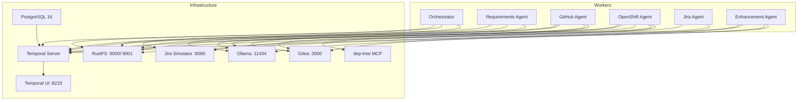

# Architecture

## System Overview

Agent SDLC Workflow uses [Temporal](https://temporal.io) as the central
orchestration engine. Each agent runs as an independent Temporal **worker**
process that polls its own **task queue**. The orchestrator dispatches work by
executing child workflows and activities on the appropriate agent's task queue.
This design keeps agents decoupled -- they share only Pydantic data models
passed through Temporal's serialization layer.

## Agent Model

Every agent follows the same structure:

| Component | Purpose |
|---|---|
| `worker.py` | Temporal worker entry point; connects to Temporal and registers workflows + activities |
| `workflows.py` | Temporal workflow definitions (deterministic orchestration logic) |
| `activities.py` | Side-effectful work: LLM calls, API requests, artifact storage |
| `settings.py` | Agent-specific `BaseAgentSettings` subclass with env-var bindings |

**Task queues** (one per agent):

| Agent | Task Queue | Responsibility |
|---|---|---|
| Orchestrator | `orchestrator` | Top-level workflow routing and phase sequencing |
| Requirements Agent | `requirements-agent` | Jira epic parsing, story proposal via LLM |
| GitHub Agent | `github-agent` | PR creation, code review, comment processing |
| OpenShift Agent | `openshift-agent` | Repo identification, feature planning, CI requirements |
| Jira Agent | `jira-agent` | Epic/story CRUD, story refinement, approval polling |
| Enhancement Agent | `enhancement-agent` | Enhancement doc generation, PR submission, approval polling |

## Data Flow

```
trigger.py
    |
    v
Orchestrator (full_sdlc workflow)
    |
    |-- Phase A --> Jira Agent: EnsureEpicWorkflow
    |-- Phase B --> Enhancement Agent: EnhancementWorkflow (generates doc from epic context)
    |-- Phase C --> Enhancement Agent: WaitForEnhancementApprovalWorkflow (human gate)
    |-- Phase D --> Mirror repos from GitHub into Gitea (Gitea only), load approved enhancement doc, fork repos_to_fork (GitHub Agent)
    |-- Phase E --> OpenShift Agent: OpenShiftFeatureWorkflow (scoped to approved repos)
    |-- Phase F --> Jira Agent: StoryRefinementWorkflow (human gate)
    |-- Phase G --> Jira Agent: CreateStoriesWorkflow
    |-- Phase H --> GitHub Agent: SetupStagingReposWorkflow
    |-- Phase I --> GitHub Agent: ImplementFeatureWorkflow
    '-- Phase J --> GitHub Agent: MonitorPRWorkflow (human gate)
```

Activities within each agent store and retrieve structured artifacts from
S3-compatible storage (RustFS). Artifacts are Pydantic models serialized to JSON
under `runs/{run_id}/` keys. See [Artifact Storage](configuration/artifact-storage.md).

## Infrastructure

The `compose.yaml` defines all services for local development:



| Service | Image | Ports | Purpose |
|---|---|---|---|
| temporal-db | postgres:16-alpine | -- | Temporal persistence (named volume) |
| temporal | temporalio/auto-setup | 7233 | Temporal gRPC frontend |
| temporal-ui | temporalio/ui | 8233 | Workflow visualization |
| minio (RustFS) | ghcr.io/rustfs/rustfs | 9000, 9001 | S3-compatible artifact storage |
| ollama | ollama/ollama | 11434 | Local LLM inference |
| gitea | gitea/gitea | 3000 | GitHub-compatible Git server |
| jira-simulator | custom build | 8080 | Minimal Jira REST API |
| dep-tree-mcp | custom build | 8811 | Repository dependency analysis via MCP |

All worker containers share a common base image (`docker/dev.Dockerfile`) and
are configured through environment variables. See
[LLM Providers](configuration/llm-providers.md) for model configuration.
