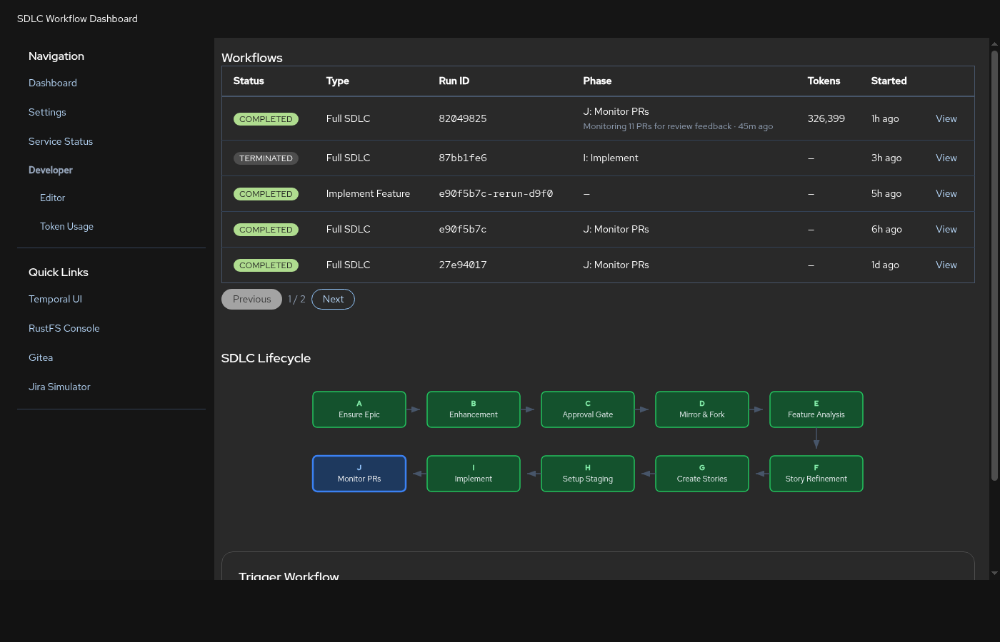
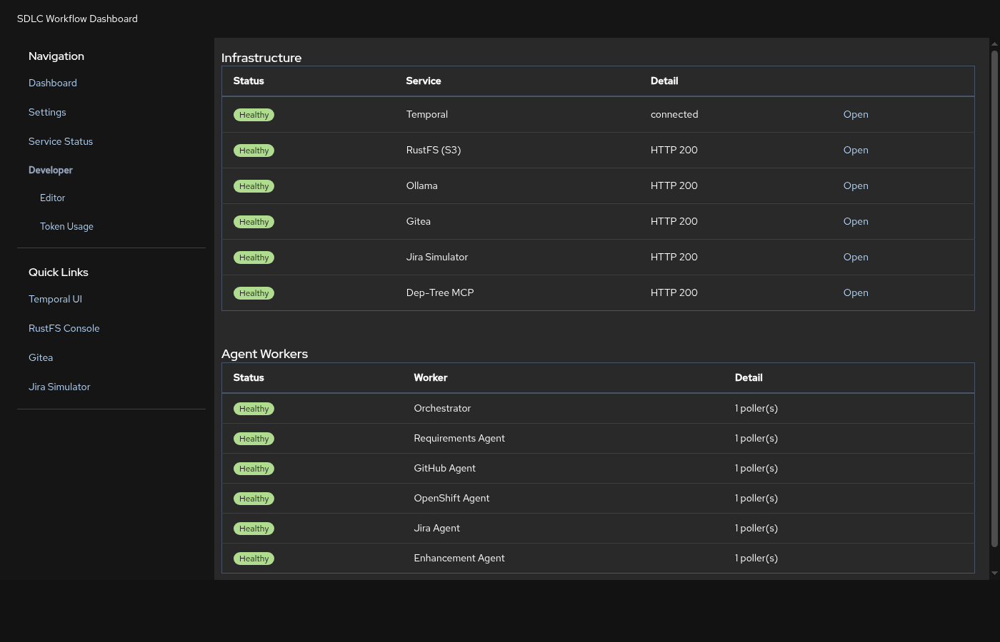
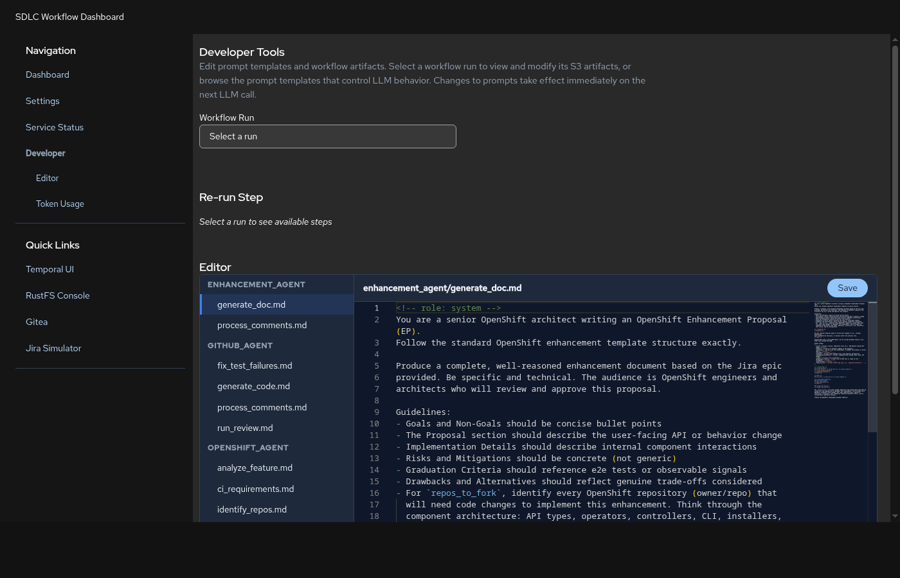
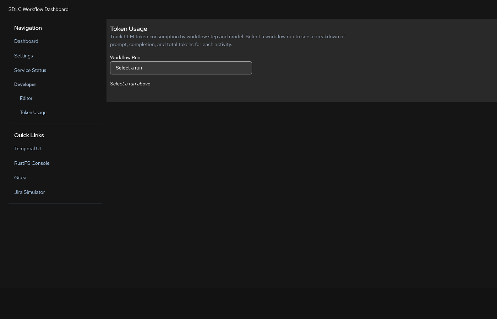
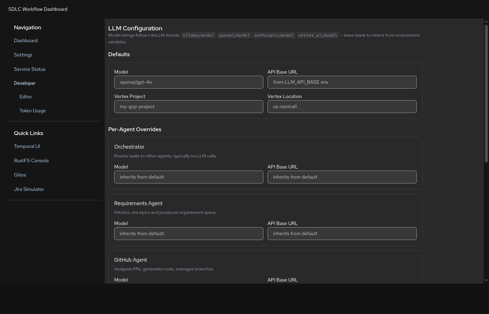

# Dashboard

The SDLC Dashboard at **http://localhost:8501** provides a web interface for
monitoring workflows, checking service health, editing prompts, and tracking
token usage. It is a server-rendered FastAPI application styled with
[PatternFly 6](https://www.patternfly.org/) and uses
[Monaco Editor](https://microsoft.github.io/monaco-editor/) for file editing.

The dashboard polls Temporal every 10 seconds to refresh workflow data. Health
checks use a 5-second TTL cache.

## Pages

### Dashboard (`/`)



The main page has three sections:

**Workflows table** -- lists all `sdlc-*` workflows from Temporal, most recent
first, paginated at 5 per page. Columns:

| Column | Description |
|---|---|
| Type | Task type label (Full SDLC, Requirements, PR Review, etc.) |
| Run ID | Short 8-character identifier |
| Status | Temporal execution status (Running, Completed, Failed, Timed Out) |
| Phase | Current phase letter and label (Full SDLC only, A through J) |
| Tokens | Total LLM tokens consumed across all steps |
| Started | Execution start time |

Clicking a Full SDLC workflow row highlights its current phase in the lifecycle
diagram and expands a PR details panel showing all associated pull requests with
per-repo status (Pending, Generating, Testing, Complete, Monitoring, Failed).

**SDLC lifecycle diagram** -- an SVG showing the 10 phases of a Full SDLC
workflow in a U-shape layout. Phases highlight automatically when a running
workflow is selected.

| Phase | Label |
|---|---|
| A | Ensure Epic |
| B | Enhancement |
| C | Approval Gate |
| D | Mirror & Fork |
| E | Feature Analysis |
| F | Story Refinement |
| G | Create Stories |
| H | Setup Staging |
| I | Implement |
| J | Monitor PRs |

**Trigger form** -- start a new workflow by selecting a task type and filling in
the required fields. Supported task types: Requirements, PR Review, Create PR,
OpenShift Feature, Full SDLC, Implement Feature, Enhancement Review.

### Service Status (`/status`)



Two tables showing the health of all system components, refreshed every 10
seconds.

**Infrastructure services:**

| Service | Health check method |
|---|---|
| Temporal | gRPC health check via SDK |
| RustFS (S3) | HTTP probe to `/health/ready` |
| Ollama | HTTP probe to `/api/tags` |
| Gitea | HTTP probe to `/api/v1/version` |
| Jira Simulator | HTTP probe to `/rest/api/2/serverInfo` |
| Dep-Tree MCP | HTTP probe to `/sse` |

**Agent workers:**

| Worker | Task queue |
|---|---|
| Orchestrator | `orchestrator` |
| Requirements Agent | `requirements-agent` |
| GitHub Agent | `github-agent` |
| OpenShift Agent | `openshift-agent` |
| Jira Agent | `jira-agent` |
| Enhancement Agent | `enhancement-agent` |

Worker health is determined by querying Temporal's `DescribeTaskQueue` API. A
worker is healthy if it has at least one active poller on its task queue.

### Developer -- Editor (`/dev`)



A split-pane editor with a file tree on the left and Monaco Editor on the right.
Two categories of files are available:

- **Prompt templates** -- Jinja2 `.md` files from the `prompts/` directory.
  Changes save to disk and take effect immediately (Jinja2 `auto_reload` is
  enabled). No worker restart required.
- **Workflow artifacts** -- JSON files from S3 under `runs/{run_id}/`. Select a
  run ID from the dropdown to browse its artifacts (requirement specs, feature
  plans, enhancement docs, staging plans, etc.).

The editor supports syntax highlighting for Markdown and JSON.

Two re-run buttons allow replaying individual workflow steps with current
prompts:

| Button | What it does |
|---|---|
| Re-run Code Generation | Starts a new `implement_feature` workflow using the selected run's staging plan and feature plan |
| Re-run Feature Analysis | Starts a new `openshift_feature` workflow using the selected run's enhancement doc |

### Developer -- Token Usage (`/dev/tokens`)



Shows LLM token consumption for a selected workflow run, broken down by step
and model. Columns: Step, Model, Prompt Tokens, Completion Tokens, Total Tokens.

Token data is captured automatically by `agents/common/llm.py` on every LLM
call and stored in S3 at `runs/{run_id}/token-usage.json`.

### Developer -- Context (`/dev/context`)

Artifact context viewer for a selected workflow run.

### Settings (`/settings`)



Per-agent LLM model configuration. Edit model routing (model string, API base,
API key) for the default and per-agent overrides. API keys are masked in the UI.
Changes write to `llm_config.yaml` and require a worker restart to take effect.

## API Endpoints

| Method | Path | Description |
|---|---|---|
| GET | `/api/health` | Infrastructure and worker health status |
| GET | `/api/health/ready` | Simple readiness probe |
| GET | `/api/workflows` | List all `sdlc-*` workflows (10s cache) |
| GET | `/api/workflows/types` | Workflow type metadata and form field definitions |
| POST | `/api/workflows/trigger` | Start a new workflow |
| GET | `/api/workflows/{run_id}/prs` | List PRs associated with a workflow run |
| GET | `/api/workflows/{run_id}/status` | Get workflow status message |
| GET | `/api/settings/llm` | Read LLM config (API keys masked) |
| PUT | `/api/settings/llm` | Update LLM config |
| GET | `/api/dev/runs/{run_id}/artifacts` | List S3 artifacts for a run |
| PUT | `/api/dev/runs/{run_id}/artifacts/{key}` | Save an edited artifact back to S3 |
| GET | `/api/dev/prompts` | List all prompt templates |
| PUT | `/api/dev/prompts/{path}` | Save an edited prompt template |
| POST | `/api/dev/runs/{run_id}/rerun/{step}` | Re-run a workflow step (`generate_code` or `analyze_feature`) |
| GET | `/api/dev/runs/{run_id}/tokens` | Token usage records for a run |

## Running the Dashboard

The dashboard runs as a compose service on port 8501:

```bash
# Start with the full stack
make dev

# Or start just the dashboard
make dev-dashboard
```

The compose service mounts `./prompts` read-write so prompt edits persist to
disk. The `--reload` flag is enabled for development, so Python code changes
restart the server automatically.

To rebuild after code changes:

```bash
podman-compose build dashboard && podman-compose up -d --force-recreate dashboard
```

## Configuration

The dashboard reads its configuration from environment variables (or `.env`):

| Variable | Default | Description |
|---|---|---|
| `TEMPORAL_HOST` | `temporal:7233` | Temporal server address |
| `TEMPORAL_NAMESPACE` | `default` | Temporal namespace |
| `S3_ENDPOINT` | `rustfs:9000` | S3-compatible storage endpoint |
| `TEMPORAL_UI_EXTERNAL_URL` | `http://localhost:8233` | Temporal UI URL for links |
| `RUSTFS_EXTERNAL_URL` | `http://localhost:9001` | RustFS console URL for links |
| `GITEA_EXTERNAL_URL` | `http://localhost:3000` | Gitea URL for links |
| `JIRA_EXTERNAL_URL` | `http://localhost:8080` | Jira simulator URL for links |
| `LLM_CONFIG_PATH` | `./llm_config.yaml` | Path to per-agent LLM config file |
